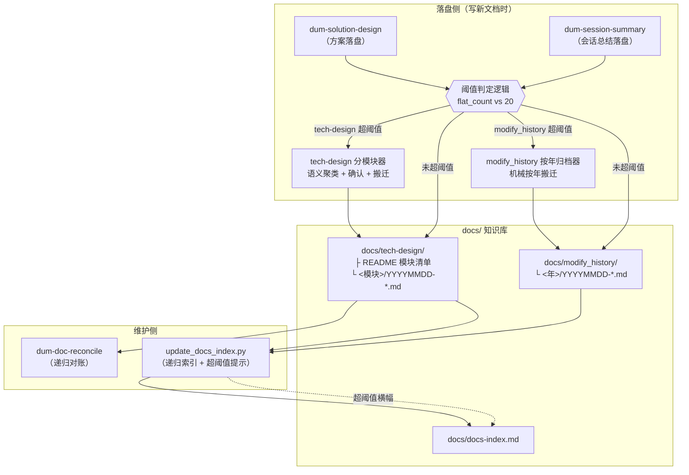
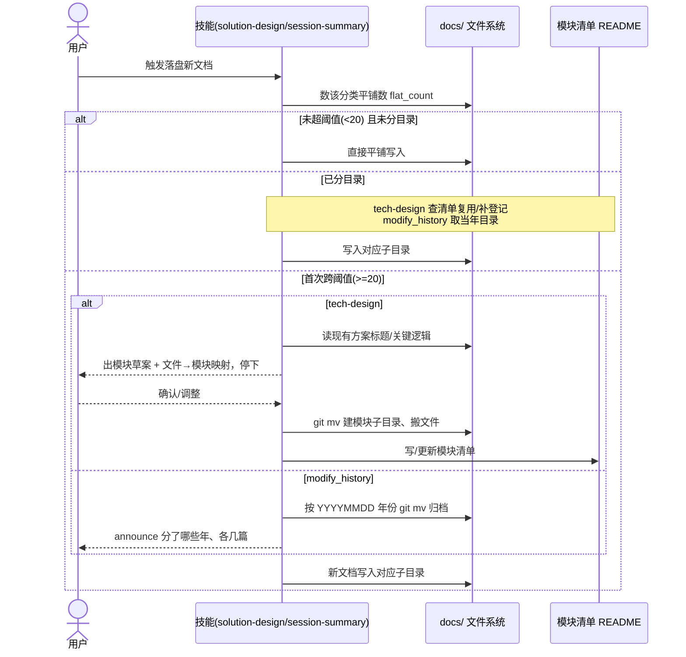
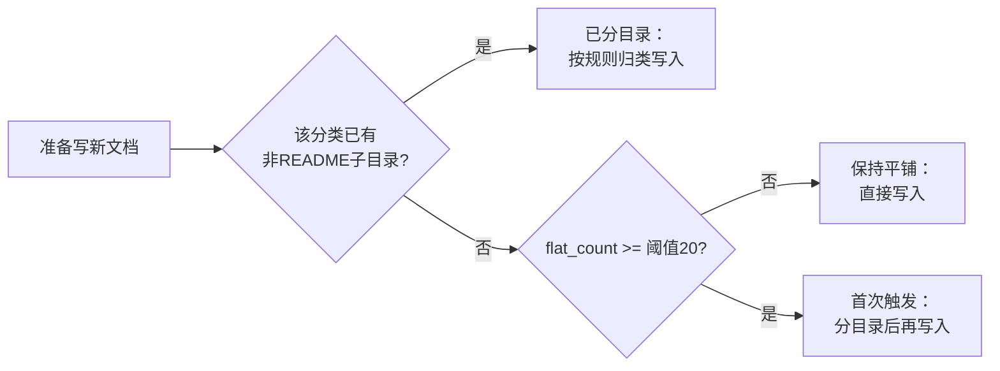

# tech-design / modify_history 按量自动分子目录 方案

> 目标：知识库里 `docs/tech-design/` 与 `docs/modify_history/` 的文档全部平铺、量大难查。
> 本方案让两目录**少则平铺、多则按量自动触发分子目录**：tech-design 按功能模块分、modify_history 按年分；
> 触发与归档由 4 个技能 + 索引脚本协作完成。

---

## 1. 架构设计 / 模块设计

本方案不是一段程序，而是把规则落在**已有 4 个技能 + 1 个索引脚本**里协作的一套机制。各参与方职责：

| 模块（落点） | 职责 | 依赖 |
|---|---|---|
| **阈值判定逻辑**（写进 dum-solution-design / dum-session-summary） | 落盘新文档前数该分类平铺数，决定「平铺 / 首次触发分目录 / 已分目录归类」三态 | 文件系统计数 |
| **tech-design 分模块器**（dum-solution-design 规则） | 跨阈值时：读现有方案语义聚类成模块草案 → 用户确认 → 建目录 / 搬文件 / 写模块清单 | 模块清单 README、用户确认 |
| **modify_history 按年归档器**（dum-session-summary 规则） | 跨阈值时：按 `YYYYMMDD` 前缀年份机械归档到 `<年>/`，announce 即可 | 文件名日期 |
| **模块清单**（`docs/tech-design/README.md`） | 登记表：模块名 + 目录 + 一句话职责，是模块复用 / 防同义词的锚点 | 由分模块器写入与维护 |
| **递归对账器**（dum-doc-reconcile 修复） | Phase 1 扫描改为递归 glob，扫到子目录里的方案文档；可按模块限定范围 | 子目录结构 |
| **索引脚本**（`update_docs_index.py`） | 递归收录子目录文档（已支持）；额外：超阈值时在索引顶部留提示横幅 | DOCS-INDEX marker |

### 1.1 组件关系图

---

## 2. 关键流程时序图

### 2.1 落盘新文档时的判定与分目录（核心 happy path）

**前置**：用户触发某技能要写一篇新文档（方案 / 会话总结）。
**后置**：文档落到正确位置；首次跨阈值时存量文件被归位。
**错误分支**：聚类草案用户不认可 → 回到草案调整，不搬文件。

### 2.2 触发三态判定（决策流程）

---

## 3. 关键逻辑

### 3.1 难点：什么算「该不该触发」——计数口径与三态判定

- **问题**：自动触发要可靠，不能反复误触发或漏触发。
- **难点**：「平铺数」要排除 README 和已归档进子目录的文件；触发应**只在首次跨阈值**发生一次，之后稳定按规则归类。
- **方案**：定义 `flat_count = 分类根目录下直接平铺的 *.md 数（排除 README.md）`；以「分类根下是否已存在非 README 子目录」作为**已分目录**标志。判定三态：
  1. 已分目录 → 直接按规则归类（tech-design 查清单、modify_history 取当年）。
  2. 未分目录且 `flat_count < 20` → 保持平铺。
  3. 未分目录且 `flat_count >= 20` → 首次触发分目录，然后写入。
- **理由**：用「已有子目录」当幂等闸，天然避免重复整库重排；计数口径排除 README/子目录文件，避免把已归档的也算进平铺触发死循环。

### 3.2 难点：tech-design 子目录「自动设计」到什么程度

- **问题**：用户希望「自动设计子目录有哪些」。
- **难点**：「某方案属于哪个功能模块」是**语义判断**，纯脚本无法从 `20260425-Xxx.md` 文件名得知它讲 auth 还是 billing；且搬错=语义损失、又动了存量文件。
- **方案（候选对比）**：
  - ❌ 纯脚本按文件名规则分：分不准，文件名无模块信息。
  - ❌ AI 全自动聚类+静默搬迁：快，但可能分得不合心意且文件已动。
  - ✅ **AI 聚类出模块草案 + 用户确认 + 再搬**：AI 读标题/关键逻辑聚类，产出「模块清单 + 文件→模块映射」，停下等确认，确认后才 `git mv`。
- **理由**：动存量文件 + 语义聚类，值得一道确认门；草案由 AI 出，用户只做「认可/微调」，兼顾自动与可控。

### 3.3 难点：modify_history 为什么按年、且可全自动

- **问题**：modify_history 是按时间追加的会话日志，一次会话常跨多模块，按模块归类有歧义。
- **难点**：要选一个**无歧义、可机械执行**的轴。
- **方案**：按 `YYYYMMDD` 前缀的**年份**归档到 `<年>/`；跨阈值时机械搬迁，announce 即可，无需逐项确认。量极大可再下沉 `年/季度`。
- **理由**：年份从文件名直接派生，确定、可逆、人和脚本都能算；避免给跨模块日志强行套模块分类。

### 3.4 难点：存量平铺文件怎么迁

- **问题**：已有一堆平铺旧文件，是否要单独大搬迁。
- **方案**：**迁移折叠进自动触发**——跨阈值那一刻就是把现有平铺文件聚类（tech-design）/ 按年（modify_history）搬进子目录的时机，不设独立的大搬迁动作；搬迁时尽力修复可见的跨文档相对链接。
- **理由**：减少一次性破坏性操作；触发点本就在加文档时，顺势归位最自然。

### 3.5 难点：分子目录后下游工具会不会漏看

- **问题**：dum-doc-reconcile Phase 1 用 `docs/tech-design/*.md` 单层 glob，子目录方案会被漏扫。
- **方案**：改为递归（`**/*.md` 或 `grep -r`）；并支持「按模块限定对账范围」。索引脚本 `update_docs_index.py::collect_category` 已用 `os.walk` 递归收录子目录，无需改核心，仅加超阈值提示横幅。
- **理由**：分目录是结构变化，所有"扫这个目录"的消费者都要跟着递归，否则结构化反而制造盲区——这是必须同步的正确性修复。

---

## 4. 接口说明

本方案主要是**技能规则约定 + 脚本契约**，无对外网络 API。约定如下：

### 4.1 目录与命名契约

| 项 | 契约 |
|---|---|
| tech-design 子目录 | `docs/tech-design/<模块>/YYYYMMDD-方案名.md`；模块名小写英文短语 |
| tech-design 兜底 | `docs/tech-design/_misc/`（不属任何模块的零散方案，可选） |
| 模块清单 | `docs/tech-design/README.md`，表头 `| 模块 | 目录 | 一句话职责 |` |
| modify_history 子目录 | `docs/modify_history/<YYYY>/YYYYMMDD-摘要.md` |
| 文件名 | 沿用 `YYYYMMDD-标题.md`，**不变** |
| 触发阈值 | tech-design 20 篇、modify_history 20 篇（均不含 README） |

### 4.2 脚本契约（`update_docs_index.py`，描述签名，非实现）

- `collect_category(dirname) -> list[(date, title, rel_link)]`：已递归，子目录文件标题前缀 `子路径/ 标题`。
- 新增 `flat_count(dirname) -> int`：返回分类根下平铺 `.md` 数（排除 README）。
- 新增提示横幅：当 `flat_count(dirname) >= 阈值` 时，在 `docs-index.md` DOCS-INDEX 区上方输出一行：
  `⚠️ <分类> 平铺已 N 篇，超过阈值 <T>，建议分子目录`（脚本只提示、不搬文件）。

### 4.3 技能落盘约定（dum-solution-design / dum-session-summary）

- 落盘前必须执行 §3.1 三态判定。
- tech-design 首次触发须「出草案 → 停下 → 确认 → 搬迁」（§2.1）。
- modify_history 首次触发机械按年搬迁 + announce。

---

## 5. 遗留问题

- **P1 · 阈值检测在技能侧靠"自觉"执行**：三态判定是写在 SKILL.md 的规则，由 agent 落盘时主动数数，并非硬性 hook 拦截。索引脚本的提示横幅是兜底信号，但不阻断。若 agent 漏判，可能短暂超阈值未分。处理时机：观察若漏判频繁，再考虑用 PreToolUse hook 做硬闸。
- **P2 · tech-design 聚类质量依赖文档标题/关键逻辑可读性**：标题含糊的旧方案可能被聚错模块，需用户在确认环节兜住。建议历史方案标题尽量含模块语义。
- **P3 · 搬迁后跨文档链接修复是"尽力而为"**：`git mv` 后，引用被搬文件的相对链接由 AI grep 尽力修，难保 100%。处理时机：搬迁后建议跑一次全库死链检查（本方案 scope 外）。
- **P4 · modify_history 按年在跨年低频项目下子目录偏空**：每年一目录、若每年寥寥几篇会显得碎。可接受；量真小本就不会触发（阈值 20）。重开触发条件：若用户反馈年目录太碎，改 `年/季度` 或回退按总量单层。
- **P5 · 多 agent 生态下脚本提示横幅依赖 Claude Code hook**：非 Claude Code agent 无 PostToolUse hook，提示横幅不会自动刷新，需手动跑脚本。与现有 dum-knowledge-base-build 的已知限制一致。

---

> 文档/代码分离：本方案为规则与脚本契约，无非平凡算法骨架，**不另出 -代码实现.md**。
> 索引脚本的 `flat_count` / 提示横幅为标准实现，落地时直接在 `update_docs_index.py` 内补，无需代码参考文档。
