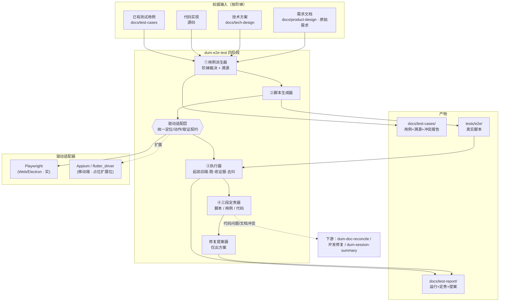
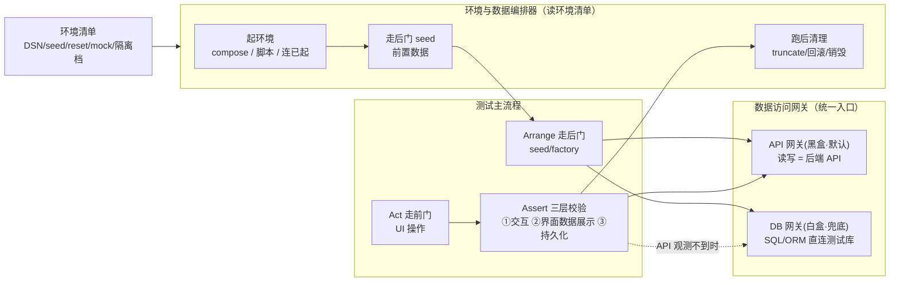
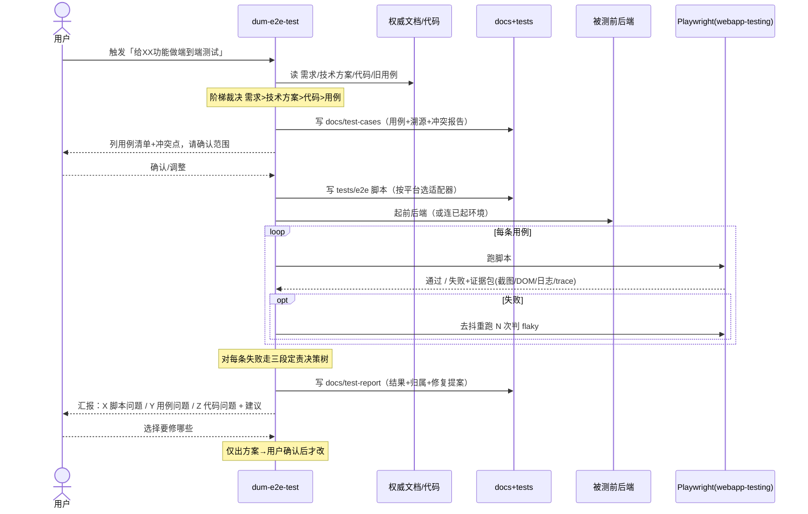
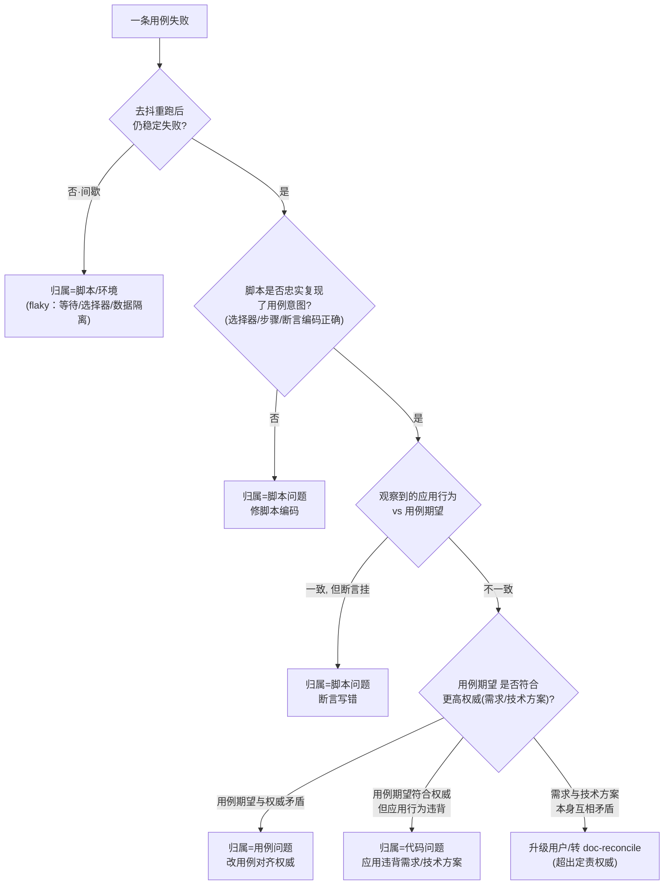
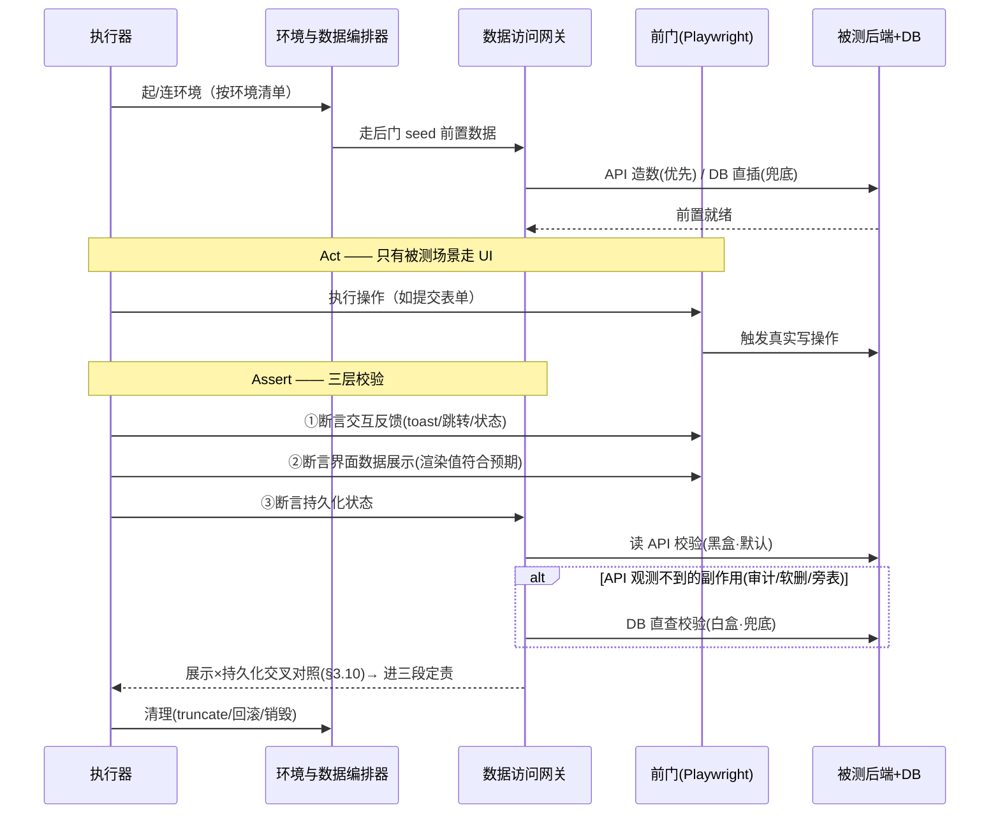

# 端到端测试技能（dum-e2e-test）方案

> 目标：新增一个工作流技能 `dum-e2e-test`，把「带后端的前端/客户端」端到端测试做成一条闭环流水线：
> **依据文档派生用例 → 生成可运行脚本 → agent 实测 → 失败三段定责（脚本/用例/代码）→ 出修复方案**。
> 当「需求文档 / 技术方案 / 代码实现 / 已有用例」四者不一致时，按 **需求 > 技术方案 > 代码 > 用例** 的权威阶梯裁决。
>
> v1 范围（已与用户确认）：
> - **平台**：Web + Electron 做实（Playwright 驱动），flutter/android/ios 以「统一驱动契约 + 占位适配器」留扩展位。
> - **执行**：技能生成脚本后，由 agent 复用 `webapp-testing`(Playwright) **真实跑测**并完成三段定责，非只产脚本。
> - **修复权限**：**仅出方案**——定责后只产出「问题归属 + 建议修复」，对脚本/用例/代码的任何实际改动都等用户确认。
> - **环境与数据**：一等模块（见 §1.3 / §3.7–3.10）。原则=**走后门布置、走前门操作、三层校验断言**；三层=**①交互反馈 ②界面数据展示 ③持久化状态**；持久化默认 **API 优先(黑盒) + DB 直查兜底(白盒)**；环境隔离用**可插拔「环境清单」+ 推荐阶梯**。

---

## 1. 架构设计 / 模块设计

`dum-e2e-test` 是一个**工作流技能**（SKILL.md 指挥 agent 的规则集 + 可复用脚手架），不是一套常驻测试框架。它把四阶段流水线落在若干协作组件上，并通过**统一驱动契约**把多端差异隔离在适配层。

| 模块（落点） | 职责 | 依赖 |
|---|---|---|
| **用例派生器**（SKILL 规则） | 读 需求/技术方案/代码/旧用例，按权威阶梯产出带**溯源链接**的测试用例 + 冲突报告 | 权威阶梯、源文档 |
| **脚本生成器**（SKILL 规则 + 模板） | 把用例翻成可运行 e2e 脚本，按目标平台走对应**驱动适配器** | 用例溯源、驱动适配层 |
| **驱动适配层**（契约 + 适配器） | 用统一定位/动作/取证契约屏蔽多端差异；Web/Electron=Playwright(实)，移动端=占位契约(扩展位) | `webapp-testing` / Appium / flutter_driver |
| **环境与数据编排器**（SKILL 规则 + 环境清单） | 按「环境清单」起干净环境、走后门 seed 前置数据、跑后清理；选定隔离档位 | 环境清单、数据访问网关 |
| **数据访问网关**（契约：API 网关 + DB 网关） | 给 seed/reset/查询断言提供统一入口；**API 优先(黑盒)**，DB 直查兜底(白盒) | 后端读写 API / 测试库连接 |
| **执行器**（SKILL 规则，复用 webapp-testing） | 起前后端、跑脚本、收集**证据包**（截图/DOM 树/控制台/网络/trace），含去抖重跑 | 驱动适配层、环境与数据编排器、被测应用 |
| **三段定责器**（SKILL 规则 = 决策树） | 对每条失败，用「权威阶梯 + 用例溯源 + 证据包」判定 脚本/用例/代码 归属 | 证据包、用例溯源 |
| **修复提案器**（SKILL 规则） | 按归属类别产出建议修复（仅出方案），等用户确认才动手 | 定责结论 |
| **测试用例库**（`docs/test-cases/`） | 用例正文 + 溯源 + 冲突报告，是定责可判定的锚点 | 由用例派生器写入 |
| **脚本目录**（`tests/e2e/`） | 真实脚本代码（Playwright spec 等），随仓库走，不入 docs | 由脚本生成器写入 |
| **测试报告**（`docs/test-report/`） | 每轮运行结果 + 定责结论 + 修复提案 | 由执行器/定责器写入 |

### 1.1 组件关系图

### 1.2 与现有技能的衔接

- **上游消费**：`dum-solution-design` 产 `docs/tech-design/`、`dum-arch-spec-doc`/`dum-knowledge-base-build` 产 `docs/architecture/` 与需求位 —— 都是本技能的权威输入。
- **复用**：`webapp-testing`(Playwright) 提供真实浏览器/Electron 驱动与日志截图能力；本技能只在其上加「用例派生 + 三段定责」的方法论。
- **下游反哺**：定责为**代码问题** → 交开发修；定责暴露**需求/技术方案彼此矛盾** → 转 `dum-doc-reconcile`；修复落地后用 `dum-session-summary` 记账。

### 1.3 环境与数据子系统

测试用例不只验证 UI，还要验证「数据操作后持久化状态符合预期」。该子系统把**起环境、布数据、校数据、清数据**四件事独立成层，主测试流程只对**数据访问网关**与**环境清单**编程，不关心目标项目用的是 PostgreSQL 还是 MySQL、起服务是 compose 还是脚本。

---

## 2. 关键流程时序图

### 2.1 全流程 happy path（派生 → 生成 → 实测 → 定责 → 提案）

**前置**：被测功能已有需求/技术方案（至少其一），本地能起前后端。
**后置**：产出用例库、脚本、运行报告与每条失败的归属+修复提案；任何改动等用户确认。
**错误分支**：源文档四者冲突 → 用例按阶梯取高权威，并在冲突报告标注；失败定责不确定 → 升级给用户裁决。

### 2.2 三段定责决策树（核心判定）

### 2.3 含数据库的单条用例：走后门布置 → 走前门操作 → 双预言机断言

**前置**：环境已起、测试库可达。**后置**：UI 与持久化状态都被断言；用例结束清理。
**错误分支**：seed/起环境失败 → 归**环境类**（不进语义定责，先修环境清单）。

---

## 3. 关键逻辑

### 3.1 难点：定责凭什么可判定 —— 用例必须带「溯源链接」

- **问题**：「自动判断是脚本/用例/代码问题」是本方案最核心、也最容易做成玄学的一步。
- **难点**：失败时光看红叉无法分辨「是应用错了」还是「是我期望错了」——缺一个**客观裁判**。
- **方案**：每条测试用例落盘时强制携带**溯源（provenance）**：它在验证哪条需求/技术方案条款（链接到具体文件+小节）。定责时把三方对照——`脚本编码 ↔ 用例期望 ↔ 权威条款`——错位发生在哪一环就归哪一类（见 §2.2）。
- **理由**：定责的本质是「应用实际行为该和谁比」。没有溯源就只能拿应用跟用例比，分不清用例对错；有了溯源，用例自身也能被更高权威证伪，三类才互斥可判。

### 3.2 难点：四者不一致怎么裁 —— 阶梯只一套、用在两处

- **问题**：需求/技术方案/代码/旧用例常彼此漂移。
- **难点**：派生用例时要选信谁；定责失败时也要选信谁——两处若用不同规则会自相矛盾。
- **方案**：全程只用一套阶梯 **需求 > 技术方案 > 代码 > 用例**。
  - **派生期**：用例的「期望」取当前可得的最高权威；低权威与之分歧统统进**冲突报告**（标注「技术方案第X节与需求第Y节不符 / 代码行为与需求不符 / 旧用例已过时」）。
  - **定责期**：同一阶梯当裁判（§2.2 的 E 节点）。
- **理由**：单一事实源避免「派生说一套、定责说另一套」；冲突报告把分歧显性化交人决策，而非技能私自抹平。

### 3.3 难点：别把 flaky 误判成代码问题

- **问题**：e2e 最大噪声是不稳定（异步未就绪、动画、数据残留、端口竞争）。
- **难点**：一次失败可能纯属抖动，若直接判「代码问题」会制造假阳性、误导开发。
- **方案**：失败先**去抖重跑 N 次**；间歇失败一律先归**脚本/环境类**（修等待策略/测试数据隔离/串行化），稳定失败才进入语义定责。证据包（截图+DOM 快照+控制台/网络日志+trace）随每次失败留存供复核。
- **理由**：把「可复现性」作为进入语义定责的前置闸，挡住绝大多数假阳性。

### 3.4 难点：脚本本身的脆弱性会污染定责

- **问题**：选择器写得脆（深层 CSS/绝对 xpath），UI 微调就挂，看着像「代码问题」其实是脚本问题。
- **方案**：脚本生成器强制**语义优先定位**——按可访问角色/可见文本/`data-testid` 定位，禁用脆性 CSS/xpath；必要时建议被测代码补 `data-testid`（作为修复提案，不私自改）。
- **理由**：把脚本类失败的源头从生成阶段就压下去，让红叉更多真正指向应用行为，定责更干净。

### 3.5 难点：多端差异如何不污染主流程（扩展位设计）

- **问题**：v1 只做 Web/Electron，但要为 flutter/android/ios 留干净扩展位，不能让移动端把主流程搅乱。
- **方案**：定义**统一驱动契约**（`launch / locate / act / observe / assert / collectEvidence / teardown`，见 §4.3），主流程只对契约编程。
  - Web/Electron：Playwright 适配器（Electron 由 Playwright 原生支持）——**做实**。
  - 移动端：仅给出契约 + 占位适配器骨架（android/ios→Appium，flutter→flutter_driver/integration_test），标注「未实现」，**不在 v1 跑**。
- **理由**：用例派生、三段定责、报告这套方法论与端无关，只有「怎么点怎么取证」因端而异；把端差异关进适配层，主流程零改动即可接新端。

### 3.6 难点：仅出方案的边界怎么守

- **问题**：技能很容易「顺手就把脚本/用例改了」，越过「仅出方案」红线。
- **方案**：定责器与提案器**只写报告、不改任何源文件**；修复提案按类别给出（脚本：改哪个选择器/等待；用例：改哪条期望并指出对齐的权威；代码：描述应有行为+疑似位置，只报告不改业务代码）。用户确认具体条目后，才进入实际修改（修改本身走常规编辑流程/ TDD）。
- **理由**：贴合用户选择的「全部仅出方案」；测试资产虽可由技能写，但「改」与「报」分离能避免自动改错、保留人对取舍的最终权。

### 3.7 难点：含数据库的用例怎么造数、怎么校验 —— 走后门 + 三层预言机

- **问题**：带后端的 e2e 要验证「数据操作后持久化状态符合预期」，且前置数据不能每次都靠 UI 点出来。
- **难点**：① 用 UI 造前置数据又慢又脆，还把"造数"和"被测场景"耦在一起；② 只看 UI 反馈无法证明数据真落对了（界面显示成功 ≠ 库里写对）；③ 反过来只看库也不够——数据正确但**前端取出来渲染**可能出错（取错字段/格式化错/缓存盖真值），那才是 e2e 该抓的。
- **方案**：
  - **Arrange 走后门**：前置数据用**数据访问网关**造——优先调后端 API（factory），无 API 再 DB 直插/seed 脚本；UI 只承担「被测场景本身」。
  - **Assert 三层预言机**：一条数据变更用例同时断言 ① **交互预言机**（toast/跳转/按钮态）② **展示预言机**（界面上呈现的数据值符合预期——列表行/详情字段/计数渲染对）③ **数据预言机**（持久化状态）。持久化默认走 **API 读校验(黑盒)**——测契约、不耦合表结构；仅当副作用 API 观测不到（审计日志 / 软删标记 / 旁表 / 计数器）才**降级到 DB 直查(白盒)**，并在用例里显式标注。
- **理由**：后门造数让用例聚焦、稳、可并行；三层预言机把数据"写进去 + 取出来渲染"两段都覆盖，才是真正的端到端；展示层与持久化层交叉对照还能直接定位前端/后端（§3.10）；API 优先把"白盒耦合 schema"的代价限制在 API 确实看不到的少数场景。

### 3.8 难点：跨项目通用的环境与隔离 —— 可插拔环境清单 + 推荐阶梯

- **问题**：这是跨项目技能，目标项目栈各异（DB 类型、起服务方式、能否直连测试库），不能硬绑一种环境方案。
- **难点**：既要"开箱能用"，又不能假设项目一定有 docker 或一定开放 test 端点。
- **方案**：技能定义一份**环境清单**（项目填：怎么起前后端、测试库 DSN、seed/reset 钩子、外部依赖 mock、选哪档隔离），主流程只读清单不写死实现；隔离能力给**推荐阶梯**，项目按自身能力就高填：
  1. **最佳**：容器化临时栈（docker-compose）——每轮抛弃式 DB+后端，跑完销毁，隔离最干净。
  2. **实用**：专用 `*_test` 库 + 按用例 `truncate&seed`，或用**唯一命名空间数据**（每用例造唯一 id/账号/租户）实现并行不撞。
  3. **兜底**：app 暴露 **test-only reset/seed 端点**（env flag 守门），测试调它复位。
- **理由**：把"环境怎么搭"外置成清单 + 阶梯，技能保持端/栈无关；阶梯给出从严到松的退路，项目能力不足也能落地，不至于因为没有容器就完全用不了。

### 3.9 难点：数据断言失败也要进三段定责，且要识别环境类

- **问题**：数据预言机挂了，同样要分清是脚本/用例/代码哪一类，还要防止把"环境/seed 没搭好"误判成代码问题。
- **方案**：扩展 §2.2 决策树到数据维度——
  - seed/起环境失败、清理残留导致脏数据 → 先归**环境类**（修环境清单，不进语义定责，类比 flaky 前置闸）。
  - 查询/网关用错（查错表、断言写错字段）→ **脚本问题**。
  - 期望的数据形态与权威（需求/技术方案的数据规则）矛盾 → **用例问题**。
  - 期望符合权威、但库里实际写错（少写/写错值/未回滚）→ **代码问题**。
- **理由**：数据类失败的噪声源（环境没搭好）和 UI 类的 flaky 同理，必须前置挡掉；其余三类仍套同一权威阶梯，保持"一套规则"。

### 3.10 难点：判到「代码问题」后，还要分前端还是后端 —— 展示×持久化交叉表

- **问题**：三段定责给出 `verdict=code` 还不够，开发想知道是改前端还是改后端。
- **难点**：单看界面或单看库都无法区分"前端没渲染对"和"后端没存对"。
- **方案**：用**展示预言机 × 持久化预言机**两轴交叉定位（前提：脚本忠实、已过 flaky/环境前置闸）：

  | 界面数据展示 | 持久化 | 定位 |
  |---|---|---|
  | ✓ | ✓ | 通过 |
  | ✗ | ✓ | **前端展示 bug**（渲染/绑定/格式化） |
  | ✓ | ✗ | 可疑：前端读缓存/乐观更新**盖住**了持久化错误，或根本没真正持久化 → 重点查写链路 |
  | ✗ | ✗ | **后端/持久化 bug** 传导到界面 |

  定责报告在 `verdict=code` 上补 `layer=frontend / backend / suspect-cache` 子标。
- **理由**：e2e 同时持有两层观测，交叉表近乎免费地把"代码问题"再切一刀，省去开发二次复现定位；"✓展示 / ✗持久化"这一格尤其值钱——它专抓乐观更新/缓存把真错盖住的隐患。

### 3.11 难点：界面数据怎么取来断言 —— 语义提取为主、截图为辅

- **问题**：展示预言机要拿到"屏幕上的数据值"才能断言，是读截图还是读调试数据？
- **难点**：截图无法精确断言数值（需 OCR 仍不准）；但纯 DOM 又看不见"被遮挡/样式崩"这类视觉问题。
- **方案**：分工而非二选一。
  - **默认 = 结构化提取（调试数据）**：从 DOM / 无障碍树读 `textContent / inputValue / 表格单元格 / ARIA 文本`，拿精确字符串做相等/正则断言。精确、报错有 diff、稳定，且**跨端可移植**（Web=DOM，Flutter=widget/semantics 树，Android/iOS=原生元素树）。
  - **截图的两个角色（不替代上面）**：① 失败时**永远存证**进证据包（供定责与人工复核）；② **补充校验**——纯像素**视觉回归**抓 DOM 看不见的问题（遮挡/截断/CSS 崩，验"看起来对不对"，可选、需基线、默认不开），**截图+OCR/多模态**仅兜底无 DOM 文本的渲染（canvas/WebGL/图表/视频）。
- **理由**：把"验数据值"交给精确的结构化提取、把"验观感"和"取证"交给截图，各用所长；视觉回归与结构化提取还互补——DOM 对而截图错正好暴露被遮挡/CSS 类缺陷（呼应 §3.10）。

---

## 4. 接口说明

本方案以**技能规则约定 + 文件/契约 schema** 为主，无对外网络 API。关键契约如下。

### 4.1 测试用例 schema（`docs/test-cases/<feature>.md`，描述字段非实现）

| 字段 | 说明 |
|---|---|
| `id` | 用例唯一编号，如 `TC-login-001` |
| `title` | 一句话场景 |
| `platform` | `web` / `electron` / `flutter` / `android` / `ios` |
| `provenance` | **溯源**：链接到权威条款，如 `需求:docs/原始需求/登录.md#密码错误` |
| `preconditions` | 前置（登录态/测试数据/后端 mock） |
| `data_setup` | **走后门**布置的前置数据：走 API 还是 DB、造哪些记录（§3.7） |
| `steps` | 步骤（语义动作，非脚本代码） |
| `expected_interaction` | **交互预言机**：操作后的 UI 反馈（toast/跳转/按钮态） |
| `expected_display` | **展示预言机**：界面上呈现的数据值应符合预期（列表行/详情字段/计数渲染，§3.7）；附取值方式 `source = dom`(默认结构化提取) / `visual`(视觉回归) / `ocr`(无 DOM 文本兜底，§3.11) |
| `expected_data` | **数据预言机**：操作后持久化状态应满足的断言 + 用哪个网关（`api` 默认 / `db` 兜底，§3.7） |
| `cleanup` | 清理方式（truncate/回滚/销毁，可继承环境清单默认） |
| `authority` | 期望所依据的最高权威层级（需求/技术方案/代码） |
| `conflicts` | 该用例相关的冲突点（指向冲突报告条目，可空） |

### 4.2 脚本与报告落点契约

| 项 | 契约 |
|---|---|
| 脚本目录 | `tests/e2e/<feature>/`（真实代码随仓库；Playwright 默认 `*.spec.ts`） |
| 脚本↔用例 | 脚本顶部注释标 `@case TC-login-001`，双向可追 |
| 运行报告 | `docs/test-report/YYYYMMDD-<feature>.md`：每条用例 通过/失败 + 证据包路径 + 定责 + 提案 |
| 证据包 | `tests/e2e/.artifacts/<run>/`：截图/DOM 快照/控制台+网络日志/trace |
| 冲突报告 | 并入用例库或同名 `-conflicts` 段：列「低权威与高权威的分歧」 |
| 用例库落点 | 沿用知识库分类，新增 `docs/test-cases/`（与 architecture/tech-design 同级） |

### 4.3 统一驱动契约（适配器接口，描述签名非实现）

> 主流程只依赖此契约；新增端＝实现一份适配器。

- `launch(target) -> session`：起/连被测应用（web url / electron 二进制 / 设备+app 包）。
- `locate(query) -> handle`：语义定位（role / text / testid 优先，§3.4）。
- `act(handle, action)`：click / fill / scroll / key 等。
- `observe() -> snapshot`：当前 DOM/widget 树 + 截图。展示预言机**默认读树（结构化提取）**断言数据值，截图供取证与可选视觉回归/OCR 兜底（§3.11）。
- `readDisplay(locator) -> string`：从树语义提取某处呈现的文本/值（展示预言机主用）。
- `assert(handle|snapshot, expectation)`：断言。
- `collectEvidence() -> bundle`：截图 + 树 + 控制台/网络日志 + trace（定责取证）。
- `teardown(session)`：清理（含测试数据回滚）。
- 适配器登记：`web/electron → Playwright（实现）`；`android/ios → Appium`、`flutter → flutter_driver`（占位，标 `not-implemented`）。

### 4.4 三段定责结果 schema（写进运行报告，描述字段）

| 字段 | 说明 |
|---|---|
| `case_id` | 关联用例 |
| `verdict` | `script` / `test-case` / `code` / `flaky` / `escalate` |
| `layer` | 仅当 `verdict=code`：`frontend` / `backend` / `suspect-cache`（由展示×持久化交叉表得出，§3.10） |
| `confidence` | 高/中/低；低或 `escalate` 必须请用户裁决 |
| `evidence` | 证据包路径 + 关键观察（交互/展示/持久化三层观测 + 期望 + 权威对照） |
| `proposal` | 建议修复（按类别，仅文字方案，不含已改动） |

> 注：`verdict` 在数据维度复用同一取值——数据 seed/环境残留归 `flaky`(环境类)，查询/网关用错归 `script`，期望数据违权威归 `test-case`，库内实际写错归 `code`（§3.9）。

### 4.5 各端适配映射（扩展位规格，描述非实现）

> 主流程（用例派生 / 三层校验 / 三段定责 / 数据网关 / 环境清单）**全端共用**；下表只列「怎么点、怎么读屏、怎么起」这层的差异。数据层（seed/API/DB 断言）各端一致。

| 端 | 驱动 | 定位（testid 类比） | 展示取值（§3.11） | 起测/环境 | v1 |
|---|---|---|---|---|---|
| Web | Playwright | role/text/`data-testid` | DOM 提取 | 起前后端 / 连 URL | **实** |
| Electron | Playwright(原生支持) | 同 Web | DOM 提取 | 起 Electron 二进制 | **实** |
| Flutter | `integration_test`+WidgetTester(白盒) 或 `flutter_driver`/`appium-flutter-driver`(黑盒) | `ValueKey`/`Semantics` label，Finder | **widget/semantics 树**提取；`CustomPaint`/图表退 截图+OCR | 模拟器/设备 + `--dart-define` 指测试后端 | 占位 |
| Android | Appium(UiAutomator2) | `resource-id`/`content-desc` | 原生元素树提取 | 模拟器/真机 + 装 apk | 占位 |
| iOS | Appium(XCUITest) | `accessibilityIdentifier` | 原生元素树提取 | 模拟器/真机 + 装 app | 占位 |

> 注：Flutter 无 DOM、render-to-canvas，故结构化提取走 widget/semantics 树而非"找原生控件"；纯截图+OCR 仅兜底无文本节点的画布渲染。Android/iOS 原生壳走 Appium 原生树。

### 4.6 数据访问网关契约（描述签名非实现）

> 供布置前置数据与数据预言机断言用；两套实现共享同一契约。

- `seed(spec) -> handle`：走后门造前置数据（API factory 优先 / DB 直插兜底）。
- `query(selector) -> rows|resource`：读持久化状态供断言（`api` 读端点 / `db` SQL/ORM）。
- `reset(scope)`：truncate / 删命名空间数据 / 调 test-only reset 端点。
- `rollback(handle)`：回滚本用例造的数据。
- 网关选择：`expected_data.gateway = api`（默认）/ `db`（兜底，需环境清单提供测试库 DSN）。

### 4.7 环境清单 schema（`docs/test-cases/<feature>` 同级或项目根，描述字段）

| 字段 | 说明 |
|---|---|
| `bring_up` | 怎么起前后端：`compose 文件` / `命令` / `连已起环境 URL` |
| `test_db` | 测试库 DSN（白盒断言/直连 reset 用，可空＝纯黑盒） |
| `seed` | seed 脚本/数据集入口 |
| `reset_hook` | 复位方式：`truncate&seed` / `test-only 端点` / `容器销毁` |
| `mocks` | 外部依赖 mock（支付/邮件/三方 API）与确定性设置（冻结时间/固定随机种子） |
| `isolation` | 隔离档位：`ephemeral-container` / `test-db-reset` / `app-reset-endpoint`（§3.8 阶梯） |
| `parallel` | 是否启用唯一命名空间数据以并行 |

---

## 5. 遗留问题

- **P1 · 移动端仅留契约未实现**：flutter/android/ios 只有占位适配器，v1 不可跑。重开触发条件：用户要做移动端时，按 §4.3 契约补 Appium/flutter_driver 适配器与设备/模拟器起测说明。
- **P2 · 预言机难题（oracle problem）天然有不可判区**：当应用行为模糊匹配权威、或权威本身留白时，三段定责无法机械裁断。本方案以 `confidence=低/escalate` 显式升级给用户，而非强行归类——这是设计取舍不是缺陷，但意味着「全自动」有上限。
- **P3 · 需求/技术方案互相矛盾时本技能不私自抹平**：定责到 `escalate`（§2.2）只转 `dum-doc-reconcile`/用户，不替用户改文档。处理时机：冲突报告积累后集中对账。
- **P4 · 环境与数据已成一等模块，但「环境清单」仍需项目逐个填**：技能给契约 + 推荐阶梯（§1.3/§3.8/§4.7），不替项目写起服务与 seed 脚本——这部分是项目特定实现，落地时随首个接入项目补一份样例清单。
- **P5 · 真实跑测依赖本地环境能起前后端**：CI 化（无头跑、并行、产物归档）本方案只给 runbook 约定，未做流水线集成。建议处理时机：用例稳定后再接 CI；`isolation=ephemeral-container` 档最易迁到 CI。
- **P6 · 白盒 DB 断言耦合 schema**：兜底用 DB 直查会绑表结构，schema 变更需同步改用例。已用「API 优先、DB 仅兜底且显式标注」把范围压到最小（§3.7），但无法消除；建议定期回看白盒断言能否上移到 API。
- **P7 · 强隔离仍依赖项目能力**：若项目既无容器化、又不开放 test 端点、又不让直连测试库，则只能退到最弱隔离，存在跨用例污染风险。重开条件：出现污染即推动项目就高填隔离档（§3.8 阶梯）。

---

> 文档/代码分离：本方案为**技能规则 + 文件/契约 schema**，无非平凡算法骨架，**不另出 -代码实现.md**。
> 待进入实施（脚手架 SKILL.md、Playwright 适配器模板、定责决策树 checklist）时，再由 `superpowers:writing-plans` 落可执行 plan；脚本模板属标准 Playwright 用法，无需代码参考文档。
