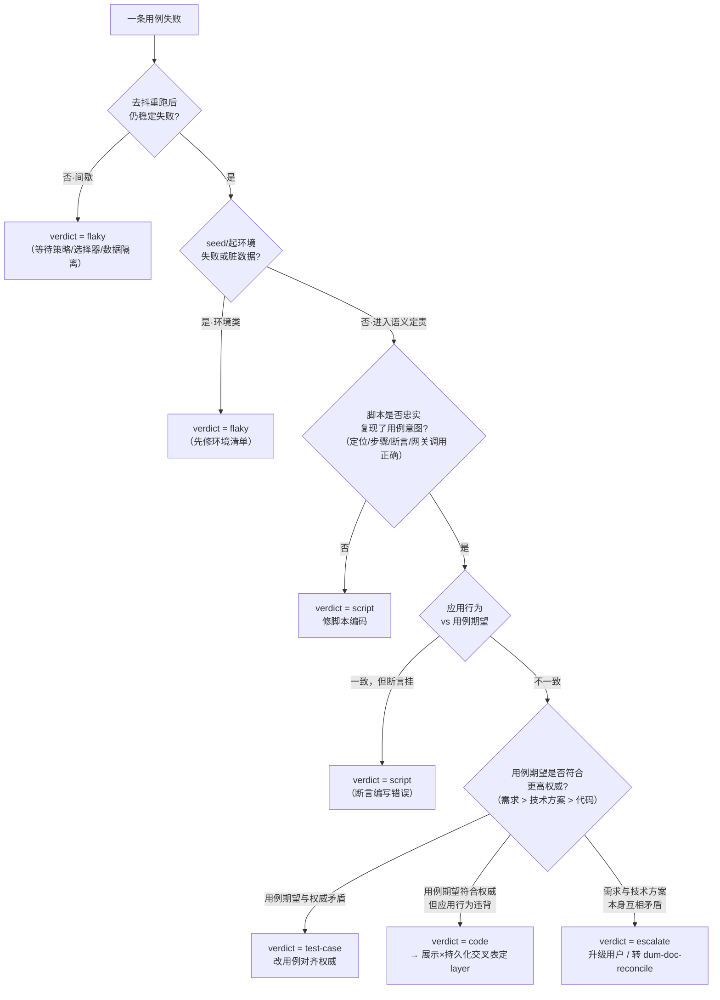

# dum-e2e-test（端到端测试闭环工作流）

## Overview

本技能把「带后端的前端/客户端」端到端测试做成四阶段闭环流水线：

```
① 用例派生  →  ② 脚本生成  →  ③ agent 实测  →  ④ 三段定责 + 修复提案
```

**权威阶梯**（贯穿全流程）：需求 > 技术方案 > 代码 > 用例。派生期望时按此阶梯裁决来源；定责失败时按此阶梯判定归属。

**四阶段一览**：

| 阶段 | 产物 | 落点 |
|---|---|---|
| ① 用例派生 | 带溯源的测试用例 + 冲突报告 | `docs/test-cases/<feature>.md` |
| ② 脚本生成 | 可运行 Playwright 脚本 | `tests/e2e/<feature>/` |
| ③ 实测 | 证据包（截图/DOM 快照/日志/trace） | `tests/e2e/.artifacts/<run>/` |
| ④ 定责 + 提案 | 运行报告 + 定责结论 + 修复方案 | `docs/test-report/YYYYMMDD-<feature>.md` |

v1 范围：Web/Electron 做实（Playwright 驱动），移动端（Flutter/Android/iOS）以统一驱动契约占位；**全程仅出方案**，实际改动须用户确认后再执行。

---

## When to Use

| 触发场景 | 例子 |
|---|---|
| 用户明确请求 e2e 测试 | "给登录功能做端到端测试" / "写 UI 自动化" / "跑 e2e" |
| 验证数据是否正确持久化 | "验证订单创建后数据库是否正确写入" |
| 验证带后端的前端行为 | "确认前端金额展示与后端一致" |
| 需求/技术方案/代码三者对齐校验 | "我改了状态机逻辑，想用例跑一遍确认" |
| 生成可运行脚本 + 实际跑测 | 不只产文档，要 agent 真实执行并报结果 |

## When NOT to Use

| 场景 | 替代 |
|---|---|
| 纯单元测试 / 接口测试，无 UI | 直接写 unit/integration test，无需本技能 |
| 一次性验证脚本，不需要用例文档 | 直接写 Playwright 脚本手跑 |
| 遇到 bug，需先定位根因 | 先用 `superpowers:systematic-debugging` |
| 只有一个简单场景，不值得派生用例 | 直接在现有用例文件里补一条，或手写脚本 |
| 移动端（Flutter/Android/iOS）已实现要跑 | v1 未支持；运行会抛 `not-implemented`，勿跑 |

---

## 核心原则

以下五条原则贯穿全部四阶段，每一步决策都须对齐。

### 1. 权威阶梯：派生与定责共用

需求 > 技术方案 > 代码 > 用例。

- **派生阶段**：用例期望以最高可得权威为准，低层与高层矛盾时高层覆盖，并在用例 `provenance` 字段记录来源。
- **定责阶段**：失败后判用例期望是否符合权威——若用例期望本身与权威矛盾，定责为「用例问题」；若用例期望符合权威但应用行为违背，定责为「代码问题」。
- 两层权威之间（如需求与技术方案）本身矛盾时，定责为 `escalate`，不私自裁决；转 `dum-doc-reconcile` 或请用户裁定。

详见 `references/triage-decision-tree.md`。

### 2. 三层校验：交互 / 界面数据展示 / 持久化

每条含数据变更的用例**必须同时断言三层**：

| 层 | 校验内容 | 对应预言机 |
|---|---|---|
| ① 交互反馈 | toast / 页面跳转 / 按钮态 / 弹窗关闭 | 交互预言机 |
| ② 界面数据展示 | 列表 / 详情 / 计数器 / 格式化值在页面上是否正确渲染 | 展示预言机（DOM 结构化提取优先） |
| ③ 持久化状态 | 操作后后端/DB 中实际存的值是否符合预期 | 数据预言机（API 黑盒优先 / DB 白盒兜底） |

三层互补：展示层对但持久化错，说明前端读了缓存掩盖了后端写错；展示错但持久化对，是前端渲染 bug。两层都错，是后端 bug 传导到界面。

详见 `references/oracle-and-data.md §2`。

### 3. 展示值提取：DOM 结构化优先，截图仅取证/兜底

展示预言机**默认 `source=dom`**：从 DOM / 语义树精确提取（`textContent` / `inputValue` / ARIA 文本）。截图有两个角色：

- **永远取证**：无论断言方式，失败时截图进证据包（`collectEvidence()`），不替代结构化提取。
- **可选校验**：`source=visual`（视觉回归，默认关闭）/ `source=ocr`（canvas/WebGL 等无 DOM 文本节点，兜底）。

**不得用截图断言数据值**——截图不可 diff，报错无明文，维护代价高。

详见 `references/oracle-and-data.md §3`。

### 4. 走后门布置、走前门操作

- **Arrange（走后门）**：前置数据通过数据访问网关造（优先 API factory，无 API 再 DB 直插/seed 脚本），**不走 UI 点击布置**，避免耦合被测场景。
- **Act（走前门）**：被测场景本身的操作全走 UI（Playwright 驱动），模拟真实用户行为。
- 环境起停、数据复位依照环境清单（`assets/env-manifest-template.yaml`），按项目实际能力选隔离档位。

详见 `references/oracle-and-data.md §1 / §4 / §5`。

### 5. 仅出方案，不私自改源文件

三段定责完成后，所有输出**仅为文字报告与修复建议**：

- 脚本问题：报告哪个定位/断言有误及建议改法，**不自动修改 `tests/e2e/`**。
- 用例问题：报告哪条期望与权威不符，**不自动修改 `docs/test-cases/`**。
- 代码问题：描述应有行为与疑似出错位置，**不自动修改任何业务代码**。
- escalate：停止定责，转交用户或 `dum-doc-reconcile`。

用户确认修复条目后，才进入实际修改。

详见 `references/triage-decision-tree.md §5`。

---

## Workflow（四阶段）

### 阶段 ① 用例派生

**目标**：从权威文档读入期望，产出带溯源的用例文件，并向用户确认范围。

**步骤**：

1. **确认测试范围**：询问用户目标功能/服务，明确平台（Web/Electron/移动端占位）。

2. **读入权威输入**（按阶梯依序查找）：
   - 需求：`docs/product-design/`、`docs/原始需求/`
   - 技术方案：`docs/tech-design/`
   - 代码实现：`src/` 等源码目录
   - 已有用例：`docs/test-cases/<feature>.md`（若存在）

3. **阶梯裁决**：对每个测试场景，以最高可得权威层的表述为准，记录 `provenance`（格式：`<层>:<文件路径>#<章节>`）；若两层权威互相矛盾，写入冲突报告，标记等待裁决，不进入脚本生成。

4. **写用例文件**（用 `assets/test-case-template.md` 为蓝本）：每个场景一个 `TC-<feature>-<序号>` 块，必填字段：`id / title / platform / provenance / steps / expected_interaction / expected_display / expected_data / authority`；冲突记录在 `conflicts` 字段。

5. **列清单请用户确认**：展示用例总数、冲突条目、范围，等用户批准后再进入阶段 ②。

**落点**：`docs/test-cases/<feature>.md`

**模板**：`assets/test-case-template.md`

---

### 阶段 ② 脚本生成

**目标**：将用户确认后的用例翻译成可运行 e2e 脚本，按平台选择适配器。

**步骤**：

1. **选平台适配器**（查 `references/platform-adapters.md §2 适配器登记`）：

   | 平台 | 适配器 | v1 可跑 |
   |---|---|---|
   | Web | `PlaywrightAdapter` | 是 |
   | Electron | `PlaywrightAdapter` | 是 |
   | Flutter / Android / iOS | 占位适配器 | 否（抛 `not-implemented`） |

2. **按统一驱动契约编程**（`references/platform-adapters.md §1`）：`launch → locate → act → observe / readDisplay → assert → collectEvidence → teardown`。定位策略：role > testId > text，**禁用脆性 CSS 路径或绝对 XPath**。

3. **翻译三层断言**：
   - ① 交互：`locate(role/testId) → assert(visible)` / 断言页面 URL 跳转
   - ② 展示：`readDisplay(locator)` 提取 DOM 文本，对比 `expected_display`
   - ③ 持久化：`gateway.query()` 调后端读 API（默认）或直连测试库（兜底，须在用例 `expected_data.gateway=db` 中标注）

4. **走后门 seed**：在 `beforeEach` 中调 `gateway.seed()` 造前置数据，`afterEach` 调 `gateway.rollback(handle)` 精确回收。

5. **写脚本**：脚本目录 `tests/e2e/<feature>/`，骨架参考 `assets/playwright-adapter-skeleton.ts`（仅作参考模板，落地按目标项目调整）。

**落点**：`tests/e2e/<feature>/`

**参考骨架**：`assets/playwright-adapter-skeleton.ts`

**适配器参考**：`references/platform-adapters.md`

---

### 阶段 ③ 实测

**目标**：起干净环境，跑脚本，收证据，去抖判 flaky。

**步骤**：

1. **读环境清单**（`assets/env-manifest-template.yaml`）：确认 `bring_up`（怎么起前后端）、`test_db`（DB DSN，可空=纯黑盒）、`seed` 脚本、`reset_hook`（复位方式）、`mocks`（外部依赖 mock）、`isolation`（隔离档位）。项目按实际能力填，档位从严到松：`ephemeral-container > test-db-reset > app-reset-endpoint`。

2. **起前后端**：按 `bring_up` 配置起服务（compose / 命令 / 连已起 URL），等健康检查就绪。

3. **走后门 seed 前置数据**：通过数据访问网关（API 优先 / DB 兜底）布置基线数据，不走 UI。

4. **复用 `webapp-testing` 跑脚本**：驱动 Playwright 执行 `tests/e2e/<feature>/` 下的脚本，按用例逐条跑。

5. **收证据包**：每条用例失败时调 `collectEvidence()`，存截图 + DOM 快照 + 控制台日志 + 网络请求日志 + trace 到 `tests/e2e/.artifacts/<run>/TC-<feature>-<序号>/`。

6. **去抖判 flaky**：失败用例重跑 3 次——间歇失败（非每次都挂）归 `verdict=flaky`，先排查等待策略 / 选择器竞态 / 数据隔离；稳定复现才进入阶段 ④。

**环境清单模板**：`assets/env-manifest-template.yaml`

---

### 阶段 ④ 三段定责 + 修复提案

**目标**：对每条稳定失败用例，依据权威阶梯 + 证据包，做出互斥可判的定责结论，写报告，出方案。

**步骤**：

1. **执行前置闸**（`references/triage-decision-tree.md §1`）：
   - 前置闸 A（稳定性闸）：间歇失败 → `verdict=flaky`，不进语义定责。
   - 前置闸 B（环境类闸）：seed / 起环境 / 清理残留导致失败 → `verdict=flaky`（先修环境清单）。

2. **语义定责**（`references/triage-decision-tree.md §2 决策树`）：



3. **`verdict=code` 时用展示×持久化交叉表定 `layer`**（`references/triage-decision-tree.md §3`）：

   | 界面数据展示（展示预言机） | 持久化状态（数据预言机） | `layer` |
   |---|---|---|
   | ✗ 不符合预期 | ✓ 符合预期 | `frontend`（渲染/绑定/格式化 bug） |
   | ✓ 符合预期 | ✗ 不符合预期 | `suspect-cache`（乐观更新或缓存掩盖持久化错误） |
   | ✗ 不符合预期 | ✗ 不符合预期 | `backend`（持久化 bug 传导到界面） |

4. **写测试报告**（用 `assets/test-report-template.md` 为蓝本）：顶部汇总 + 每条用例定责字段（`verdict / layer / confidence / evidence / proposal`）；`proposal` 仅文字方案，不含已改动代码，等用户确认后执行。

5. **出方案，等确认**：展示报告，按类别汇总问题，等用户确认具体修复条目后，再进入实际改动（改脚本走常规编辑，改代码走 TDD/systematic-debugging）。

**定责决策树**：`references/triage-decision-tree.md`

**报告模板**：`assets/test-report-template.md`

---

## Output Specification

| 产物 | 落点（强制） | 格式 |
|---|---|---|
| 测试用例 | `docs/test-cases/<feature>.md` | Markdown，按 `assets/test-case-template.md` |
| e2e 脚本 | `tests/e2e/<feature>/` | TypeScript（Playwright spec），按 `assets/playwright-adapter-skeleton.ts` 骨架落地 |
| 证据包 | `tests/e2e/.artifacts/<run>/` | 按用例子目录，含截图/DOM 快照/console.log/network.json/trace.zip |
| 测试报告 | `docs/test-report/YYYYMMDD-<feature>.md` | Markdown，按 `assets/test-report-template.md` |
| 环境清单 | 项目根 或 `docs/test-cases/` 同级 | YAML，按 `assets/env-manifest-template.yaml` |

---

## Quick Reference

| 项 | 规则 |
|---|---|
| 权威阶梯 | 需求 > 技术方案 > 代码 > 用例；派生与定责共用 |
| 三层校验 | 每条数据变更用例须同时断言：①交互 ②展示 ③持久化 |
| 展示值提取 | 默认 `source=dom`（`textContent`/`inputValue`/ARIA）；截图仅取证/可选视觉回归/OCR 兜底 |
| 走后门 seed | 前置数据走 API factory 或 DB 直插，禁止走 UI |
| 持久化断言 | 默认 `gateway=api`（API 黑盒）；仅当 API 观测不到时才 `gateway=db`（白盒），须在用例中标注原因 |
| 去抖重跑 | 失败先重跑 3 次；间歇失败 → flaky，先排查等待/竞态/数据隔离 |
| 定责结论互斥 | `script` / `test-case` / `code` / `flaky` / `escalate` 五类，互斥可判 |
| `verdict=code` 时必须补 `layer` | `frontend` / `backend` / `suspect-cache`，三选一 |
| 仅出方案 | 定责后只产报告与建议，**不自动修改任何脚本/用例/业务代码** |
| v1 平台 | Web / Electron 实测；Flutter/Android/iOS 占位 |
| 用例落点 | `docs/test-cases/<feature>.md` |
| 脚本落点 | `tests/e2e/<feature>/` |
| 报告落点 | `docs/test-report/YYYYMMDD-<feature>.md` |

---

## Common Mistakes

| 错误 | 后果 | 修正 |
|---|---|---|
| 用截图断言数据值（`source=visual` 做数值比较） | 截图不稳定、报错无明文、维护代价高 | 改用 `readDisplay(locator)` 从 DOM 提取文本断言 |
| 只断言交互（toast 通过）就判成功，不断言持久化 | 漏掉存储层 bug | 数据变更用例必须三层全断言 |
| 走前门 UI 造前置数据（如点击「新增」创建测试记录） | 与被测场景耦合，数据混污，flaky | 改走后门 `gateway.seed()` 或 DB 直插 |
| 失败没去抖就定责「代码问题」 | flaky 被误判为代码 bug | 先重跑 3 次确认稳定失败，再进语义定责 |
| `verdict=code` 时不填 `layer` | 开发不知道改前端还是后端 | 必须按展示×持久化交叉表补 `layer` |
| 用 CSS 路径 / 绝对 XPath 定位 | 选择器脆，DOM 一改就挂 | 改用 role / testId / 可见文本定位 |
| 私自修改业务代码 | 超出本技能权限，越权 | 出方案，等用户确认后执行 |
| 移动端当作 v1 已实现去跑 | 占位适配器抛 `not-implemented`，造成混乱 | v1 只跑 Web/Electron；移动端待后续版本 |
| 两层权威矛盾时私自裁决 | 可能选了错误的权威层，掩盖文档冲突 | 标 `verdict=escalate`，转 `dum-doc-reconcile` 或请用户裁决 |
| 用例文件不记录 `provenance` | 定责时无法判用例期望来自哪层权威 | 每条用例必须填 `provenance` 字段 + 层级 |

---

## Red Flags — STOP

出现下面任何一项 = 你正在偏离本技能，**立即停下、修复、重读再继续**：

- 正在修改 `tests/e2e/` 脚本或 `docs/test-cases/` 用例或任何业务代码，而没有等用户确认 → 停，改为写 `proposal` 字段等确认
- `verdict=code` 的定责结论里没有 `layer` 字段 → 补填 `frontend / backend / suspect-cache`
- 失败用例没有经过去抖重跑（3 次）就进入语义定责 → 先去抖
- 用截图的像素值作为数值断言依据 → 改用 DOM 结构化提取
- 用 UI 操作（点击/填表）作为 `beforeEach` 的数据 seed 方式 → 改走后门网关
- 展示预言机层断言缺失（只断言了交互和持久化，漏了界面渲染值） → 补 `expected_display` 断言
- 两层权威（如需求 vs 技术方案）互相矛盾时私自裁决以哪个为准 → 标 `escalate`，停止定责，提交用户
- 在 v1 跑移动端平台（flutter/android/ios）的测试 → 停，告知用户 v1 仅支持 Web/Electron
- 环境清单缺失（`bring_up` / `isolation` 未填）就直接跑测 → 先补环境清单，确认环境能起干净
- 证据包没有收集（失败时 `collectEvidence()` 未调用）就出定责结论 → 先收取证据包，证据是定责依据

---

## Cross-References

| 技能 / 工具 | 与本技能的关系 |
|---|---|
| `webapp-testing` | 实测驱动（阶段③复用）：提供真实 Playwright/Electron 执行能力，本技能在其上加用例派生 + 三段定责方法论 |
| `dum-solution-design` | 技术方案输入（阶段①权威阶梯第二层）：`docs/tech-design/` 是用例期望的主要权威来源之一 |
| `dum-knowledge-base-build` | 知识库 / 需求输入：搭建 `docs/` 文档体系，提供需求文档位置（阶段①权威阶梯第一层） |
| `dum-arch-spec-doc` | 架构/规范输入：产出 `docs/architecture/`，辅助判断数据访问方式与模块边界（阶段①权威输入） |
| `dum-doc-reconcile` | 文档冲突下游：`verdict=escalate`（需求与技术方案矛盾）时转交，对账后更新权威文档 |
| `dum-session-summary` | 修复记账：用例/脚本/代码修复落地后，用本技能记录本次会话改动到 `docs/modify_history/` |
| `superpowers:writing-plans` | 修复实施：用户确认定责结论后，用本技能把修复条目拆成可执行 plan，再逐步实施 |
