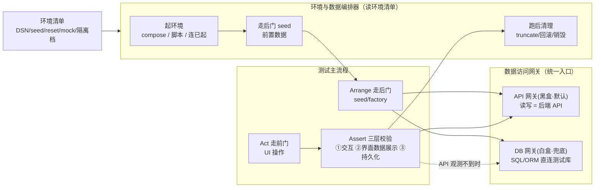
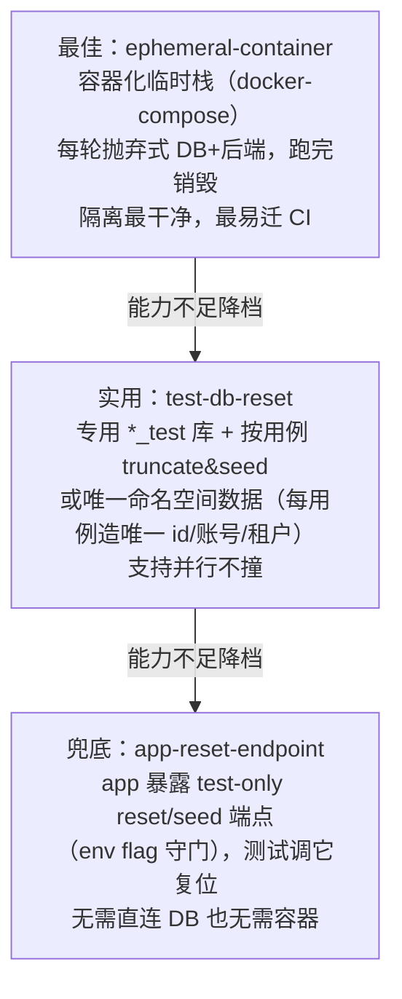

# 三层校验与数据网关 Reference

> 本文件是 `dum-e2e-test` 的方法论参考，供 `assets/test-case-template.md` 与 `assets/env-manifest-template.yaml` 的字段提供语义依据。
> 正文中文；图用 Mermaid；不含实现代码——只有签名/schema/字段清单/伪代码/决策图。

---

## 1. 总原则：走后门布置、走前门操作、三层校验断言

端到端测试的核心原则：

- **Arrange — 走后门**：前置数据通过数据访问网关造（优先 API factory，无 API 再 DB 直插/seed 脚本）；UI 只承担「被测场景本身」，不用来做前置数据布置。
- **Act — 走前门**：被测场景本身的操作全部走 UI（Playwright 等驱动），模拟真实用户行为。
- **Assert — 三层校验**：每条数据变更用例同时断言 ① 交互反馈 ② 界面数据展示 ③ 持久化状态，三层缺一不可。

### 环境与数据子系统图（来自方案 §1.3）



---

## 2. 三层预言机

一条数据变更用例须同时断言以下三层，构成互补的完整校验：

### ① 交互预言机

验证操作后的即时 UI 反馈，包括：

- **Toast / 通知消息**：成功/失败提示文本、出现时机、消失行为
- **页面跳转**：操作后路由是否跳转到预期页面（URL / 路由名）
- **组件状态变化**：按钮态（加载中/禁用/恢复）、表单清空、弹窗关闭、Tab 切换

这层校验确认「应用已感知到用户操作」，是最快反馈的层次。

### ② 展示预言机（界面数据展示）

验证操作后界面上**呈现的数据值**符合预期，包括：

- 列表行中新增/变更的记录是否正确渲染
- 详情页字段是否展示正确值
- 计数器/统计数字是否更新
- 格式化输出（日期/金额/单位）是否正确

展示预言机抓住「写进去的数据被取出来渲染」这一段——数据存对了但前端取错字段/格式化错/缓存覆盖真值，都会在这层暴露。取值方式见 §3。

### ③ 持久化预言机（数据预言机）

验证操作后**持久化状态**满足预期。

**默认：API 黑盒优先**
- 通过后端读接口校验，测试契约不耦合表结构
- 适用于绝大多数 CRUD 场景

**降级到 DB 白盒兜底的条件**（以下情形 API 观测不到，须直查数据库）：

| 场景 | 说明 |
|---|---|
| 审计日志 | 操作触发的审计记录，无对外 API |
| 软删除标记 | `deleted_at` 等列，读接口通常过滤不展示 |
| 旁表副作用 | 触发对关联表的写入，无独立查询端点 |
| 计数器/汇总 | 异步累加类字段，读 API 反映的是缓存值 |

降级到白盒时，须在用例 `expected_data` 字段显式标注 `gateway = db`，并说明原因。

---

## 3. 展示值怎么取（`source` 字段）

展示预言机断言时，取值方式由 `source` 字段控制，取值为 `dom | visual | ocr`。

### 默认：结构化提取（`source = dom`）

从 DOM 或平台语义树中精确读取：

- Web / Electron：`textContent`、`inputValue`、表格单元格文本、`ARIA` 文本属性
- Flutter：widget/semantics 树节点文本
- Android / iOS：原生元素树可访问文本

**优先使用此方式**：结果精确、报错有 diff、稳定、跨端可移植。

### 截图的两个角色（不替代结构化提取）

截图承担两个**补充**角色，而非替代 DOM 提取：

**角色一：永远取证（`source = dom` 时也做）**

失败时截图强制进入证据包（`collectEvidence()`），供定责与人工复核；成功时可选保留。截图是证据，不是断言主体。

**角色二：可选校验**

- `source = visual`（视觉回归）：像素级对比，发现遮挡/截断/CSS 崩等 DOM 看不见的视觉问题。需维护基线，默认关闭，按需开启。
- `source = ocr`（OCR / 多模态兜底）：仅用于无 DOM 文本节点的渲染场景，如 canvas/WebGL 图表、视频水印。不准确，仅兜底，优先找 DOM 替代。

### `source` 取值一览

| 值 | 含义 | 何时用 |
|---|---|---|
| `dom` | 结构化提取（默认） | 绝大多数场景，有 DOM/语义树时优先 |
| `visual` | 截图视觉回归 | 验"看起来对不对"（遮挡/CSS 崩），可选 |
| `ocr` | 截图 + OCR / 多模态 | canvas/WebGL 等无 DOM 文本的渲染，兜底 |

---

## 4. 数据访问网关契约

> 契约描述签名与语义，不含实现代码。两套实现（API 网关 / DB 网关）共享此契约。

网关是布置前置数据与数据预言机断言的统一入口，将 seed/query/reset/rollback 四个操作与底层技术解耦。

### 四个操作签名

```
seed(spec) -> handle
```
走后门造前置数据。优先调后端 API factory；无 factory 时 DB 直插或跑 seed 脚本。返回 `handle` 供后续 `rollback` 引用。

```
query(selector) -> rows | resource
```
读持久化状态供断言。`gateway = api` 时调后端读端点；`gateway = db` 时执行 SQL/ORM 查询。

```
reset(scope)
```
复位指定范围的数据：truncate 表、删命名空间数据、或调用 test-only reset 端点。

```
rollback(handle)
```
回滚本用例通过 `seed` 造的数据，按 `handle` 精确回收，避免污染其他用例。

### 网关选择规则（`gateway` 参数）

| 值 | 含义 | 选用条件 |
|---|---|---|
| `api`（默认） | API 黑盒网关 | 后端有对应读接口，测契约不耦合表结构 |
| `db`（兜底） | DB 白盒网关 | 副作用 API 观测不到（审计/软删/旁表/计数器）；需环境清单提供测试库 DSN |

用例的 `expected_data.gateway` 字段显式声明选择，默认 `api`；选 `db` 时须说明原因。

---

## 5. 环境与隔离阶梯

### 可插拔环境清单

技能定义**环境清单**（`env-manifest`），主流程只读清单不写死实现。项目在清单中填：

| 字段 | 说明 |
|---|---|
| `bring_up` | 怎么起前后端：`compose 文件` / `命令` / `连已起环境 URL` |
| `test_db` | 测试库 DSN（白盒断言/直连 reset 用，可空＝纯黑盒） |
| `seed` | seed 脚本/数据集入口 |
| `reset_hook` | 复位方式：`truncate&seed` / `test-only 端点` / `容器销毁` |
| `mocks` | 外部依赖 mock（支付/邮件/三方 API）与确定性设置（冻结时间/固定随机种子） |
| `isolation` | 隔离档位（见下方阶梯） |
| `parallel` | 是否启用唯一命名空间数据以并行 |

**项目按自身能力就高填**——阶梯给出从严到松的退路，能力不足也能落地。

### 隔离阶梯（从严到松）



### 隔离档位说明

| 档位（`isolation` 值） | 实现方式 | 适用条件 |
|---|---|---|
| `ephemeral-container` | docker-compose 每轮新建 DB+后端，跑完销毁 | 有 Docker，追求最干净隔离与 CI 可迁移 |
| `test-db-reset` | 专用 `*_test` 库 + truncate&seed；或唯一命名空间并行 | 有独立测试库，可直连；无容器或嫌容器慢 |
| `app-reset-endpoint` | 后端暴露 test-only reset/seed HTTP 端点（env flag 守门） | 无容器、无直连 DB，仅能调 HTTP |

> **原则**：项目就高填隔离档。若既无容器、又不开放 test 端点、又不让直连测试库，则只能退到最弱隔离，存在跨用例污染风险——应推动项目升级隔离能力。

### 与数据网关的衔接

隔离阶梯决定「怎么起环境 / 怎么清数据」；数据网关决定「怎么造数据 / 怎么查数据」。两者通过**环境清单**解耦：

- `isolation = ephemeral-container` → `reset` 操作销毁容器重建
- `isolation = test-db-reset` → `reset` 操作执行 truncate + seed 脚本
- `isolation = app-reset-endpoint` → `reset` 操作 POST test-only 端点

---

> **与测试用例模板的对应关系**：
> - `expected_interaction` → §2 ① 交互预言机
> - `expected_display(source)` → §2 ② 展示预言机 + §3 取值方式
> - `expected_data(gateway)` → §2 ③ 持久化预言机 + §4 数据网关契约
> - `env-manifest-template.yaml` → §5 环境清单字段
