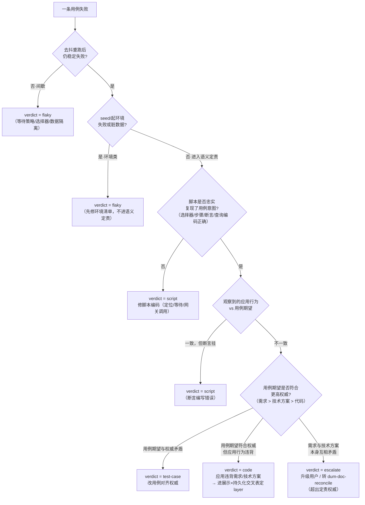

# 三段定责决策树

> 用途：指导 `dum-e2e-test` 技能对每条 e2e 失败用例执行「脚本 / 用例 / 代码」三段归责裁决，保证定责有据可查、结论互斥可判。  
> 本文件是**方法论 reference**，仅含决策逻辑与字段定义，**不包含可运行实现代码**。

---

## 1. 定责前置闸

在进入语义定责之前，必须先通过两道前置闸，否则打回修环境/脚本，**不进入三段语义定责**：

### 前置闸 A：稳定性闸（防 flaky 误判）

- **操作**：失败后去抖重跑 N 次（建议 3 次）。
- **间歇失败**（非每次都挂）→ 归 **flaky 类**，先排查：
  - 等待策略（异步未就绪、动画）
  - 选择器竞态
  - 测试数据隔离不足（跨用例污染）
  - 端口/进程竞争
- 只有**稳定复现**的失败才进入下一步。

### 前置闸 B：环境类闸（防环境/数据污染误判）

- **若 seed / 起环境 / 前置数据准备失败**，或**清理残留导致脏数据** → 归 **环境类**：
  - 先修**环境清单**（`bring_up` / `seed` / `reset_hook` / `isolation` 字段）。
  - 不进入语义定责。
- 环境类与 flaky 类在 verdict 上均取 `flaky`（见 §4.4 注解）。

---

## 2. 三段定责决策树

转写自方案 §2.2，扩展了数据维度（§3.9）。

> **权威阶梯**：需求 > 技术方案 > 代码 > 用例。  
> 判节点 E 时，以当前可得的最高权威为准；两层权威自身矛盾时，才走 `escalate`。

---

## 3. 展示×持久化交叉表

适用于 `verdict=code` 的进一步定位（前提：已通过 §2 的脚本忠实性核查 + 前置闸）。  
转写自方案 §3.10。

| 界面数据展示（展示预言机） | 持久化状态（数据预言机） | 定位 | `layer` 子标 |
|---|---|---|---|
| ✓ 符合预期 | ✓ 符合预期 | **通过** | — |
| ✗ 不符合预期 | ✓ 符合预期 | **前端展示 bug**（渲染/绑定/格式化错误） | `frontend` |
| ✓ 符合预期 | ✗ 不符合预期 | **可疑：前端读缓存或乐观更新盖住了持久化错误**；或根本未真正持久化 → 重点查写链路 | `suspect-cache` |
| ✗ 不符合预期 | ✗ 不符合预期 | **后端/持久化 bug** 传导到界面 | `backend` |

**说明**：

- 展示预言机默认从 DOM / 语义树**结构化提取**（`textContent` / `inputValue` / 表格单元格 / ARIA 文本）；截图作为取证存档与可选视觉回归，不替代结构化提取。
- 数据预言机默认走**后端读 API（黑盒）**；仅当副作用 API 观测不到（审计日志 / 软删标记 / 旁表 / 计数器）时，才降级到 **DB 直查（白盒）**，并在用例里显式标注。
- 当 `verdict=code` 时，**必须**补 `layer` 字段（取值：`frontend` / `backend` / `suspect-cache`），供开发直接定位改动方向。

---

## 4. 定责结论字段

写入 `docs/test-report/YYYYMMDD-<feature>.md`，对应方案 §4.4。

| 字段 | 类型 | 说明 |
|---|---|---|
| `case_id` | string | 关联用例编号，如 `TC-login-001` |
| `verdict` | enum | `script` / `test-case` / `code` / `flaky` / `escalate`（见下） |
| `layer` | enum | 仅当 `verdict=code` 时填写：`frontend` / `backend` / `suspect-cache` |
| `confidence` | enum | `高` / `中` / `低` |
| `evidence` | string | 证据包路径 + 关键观察（交互 / 展示 / 持久化三层 + 期望值 + 权威对照） |
| `proposal` | string | 建议修复（按类别，仅文字方案，不含已改动代码或文件） |

**`verdict` 取值语义**：

| 取值 | 语义 |
|---|---|
| `script` | 脚本编码问题（选择器脆/步骤漏/断言写错/网关调用错） |
| `test-case` | 用例期望问题（与更高权威矛盾，需改用例对齐权威） |
| `code` | 应用代码问题（行为违背需求或技术方案；必须补 `layer`） |
| `flaky` | 不稳定或环境类（包括：间歇失败、seed 失败、脏数据残留） |
| `escalate` | 超出定责权威（需求与技术方案互相矛盾，需用户/doc-reconcile 裁决） |

**强制规则**：

- `confidence=低` 时，必须在 `proposal` 中明确标注「需用户裁决」。
- `verdict=escalate` 时，必须暂停自动定责，向用户展示矛盾点并请求裁决（或转 `dum-doc-reconcile`）。

---

## 5. 仅出方案边界

> **定责器只写报告，不改任何源文件。**

本技能三段定责完成后，所有输出**仅为文字报告与修复建议**，遵守以下边界：

- **脚本问题**：报告哪个定位/等待/断言/网关调用有误及建议改法；**不自动修改 `tests/e2e/` 脚本**。
- **用例问题**：报告哪条期望与权威（需求/技术方案）不符，建议如何对齐；**不自动修改 `docs/test-cases/`**。
- **代码问题**：描述应有行为与疑似出错位置；**不自动修改任何业务代码**。
- **escalate**：转交用户裁决或触发 `dum-doc-reconcile`，定责器不私自决断。

用户确认具体修复条目后，才进入实际修改（修改本身走常规编辑流程 / TDD）。  
这条边界是**设计约束**，不是操作建议——技能内任何步骤都不得绕过。

---

*本文件供 `SKILL.md` 「三段定责」段引用，并与 `assets/test-report-template.md` 的 `verdict` / `layer` 字段定义保持严格一致。*
