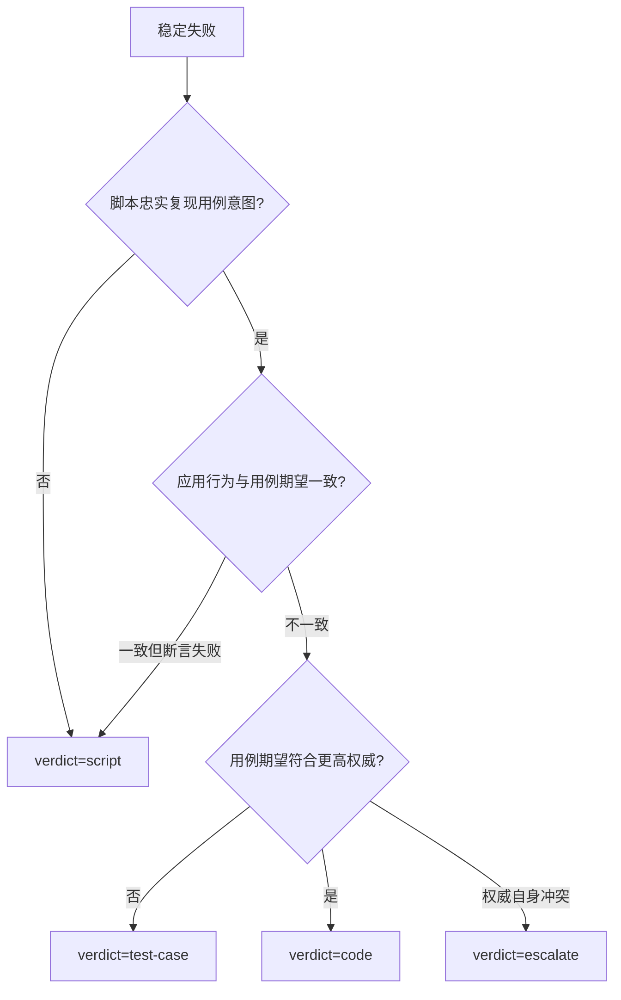

# E2E 失败定责决策树

## 1. 先保存首因

保留第一条业务、断言或 Runner 错误及时间。以下后续异常只能作为附加证据，不能覆盖首因：

- pending frame / `pumpAndSettle` 超时；
- late network / Dio 异常；
- dispose 后回调；
- 对端因首个 actor 失败而退出；
- cleanup 失败。

测试完成后发生的异步异常仍会使本轮失败，但定责时必须区分首因与次生错误。

## 2. 失败阶段

先填写 `failure_phase`：

| 阶段 | 典型问题 |
|---|---|
| `preflight` | 工具链、服务、账号、能力、设备、Secret、fixture |
| `build` | SDK/package_config 不一致、依赖签名、symlink、编译、安装、签名、Xcode build.db |
| `selection` | 路径错误、未登记、选择为 0、`No tests ran` |
| `launch` | 应用无法启动或登录 |
| `coordination` | actor/stage 事件缺失、对端失败、批次超时 |
| `ui` | Finder、hit-test、滚动、遮挡、手势、交互反馈 |
| `display` | UI 数据错误或未按刷新语义更新 |
| `persistence` | API/DB 最终状态错误 |
| `cleanup` | 删除、恢复或残留审计失败 |
| `teardown` | 未 await、dispose 后工作、异步异常 |

`No tests ran`、选择为 0、真实文件未登记一律归 `selection + script/runner`，不是业务代码问题。

## 3. 前置闸

### 稳定性

对适合重跑的失败去抖重跑。间歇失败通常归 `flaky`，子类可为：

- `wait-race`
- `finder-race`
- `dirty-data`
- `device-contention`
- `network-environment`

稳定重现再进入语义定责。不要对确定性的权限、契约或断言失败盲目重跑。

### 环境

区分：

- hard dependency：缺失或不健康，preflight 直接失败；
- soft dependency：记录旁路噪声，不直接判业务失败；
- optional：按用例约定 skip 或降级。

Docker daemon 可用不等于业务服务健康。账号配置写着某角色也不等于实际具备该 capability，必须读回验证。

Flutter 的 `.fvmrc`、实际 SDK 和 package_config 不一致，或同 workspace 存在 startup/build.db 锁时，归 `preflight/build + environment/toolchain`；业务 UI 尚未启动，不能判模块功能失败。

## 4. 语义定责



权威阶梯：

```text
需求 > 技术方案 > 当前代码 > 已有用例
```

脚本忠实性包括：

- 权威用例中的每个 Step 都有同 actor 的真实动作和同编号断言；
- UI 前门真实执行，而不是由 API 替代 Act；
- Finder、手势、等待和 actor 正确；
- API 查询字段、资源 ID、实例键和时间键正确；
- 刷新语义符合产品行为；
- 断言比较的是正确角色仍可读取的数据。

Finder 失败先区分：数据不存在、Widget 未构建、已构建但不可见、可见但不可点击、权限/状态不渲染。若脚本使用合法前门稳定复现真实视口/遮挡缺陷，应判产品代码问题并加回归测试，不能永久滚到安全位置掩盖问题。

## 5. 展示 × 持久化

| UI 展示 | 持久化 | 定位 | subtype |
|---|---|---|---|
| 正确 | 正确 | 通过 | — |
| 错误 | 正确 | 前端渲染、绑定、刷新或格式化 | `frontend` |
| 正确 | 错误 | 乐观更新/缓存可能掩盖写失败 | `suspect-cache` |
| 错误 | 错误 | 后端或持久化链路 | `backend` |

若 API 正确、UI 旧值，先核对 `refresh_semantics`。只有超过契约规定的刷新条件仍旧值，才判代码问题；任意延长 sleep 不是修复。

角色状态变化后可能失去资源读取权限。拒绝邀请的一方出现 403/404 时，改用组织者或仍有权限的 actor 验证最终状态，不能直接判 persistence 失败。

## 6. 结论字段

| 字段 | 说明 |
|---|---|
| `case_id` | 权威用例 ID |
| `failure_phase` | preflight/build/selection/launch/coordination/ui/display/persistence/cleanup/teardown |
| `verdict` | script/test-case/code/flaky/escalate |
| `subtype` | runner/finder/gesture/frontend/backend/suspect-cache/environment/contract 等 |
| `confidence` | 高/中/低 |
| `first_failure` | 首因、时间和原始摘要 |
| `secondary_errors` | 次生异常列表 |
| `peer_exit` | 对端因首败被终止的退出码，例如 143；不得覆盖首因 |
| `partial_evidence` | 已观察到的局部链路证据，不等于整条 case 通过 |
| `evidence` | 截图、树、API 摘要、actor/协调日志、退出码 |
| `proposal` | 建议修复和验证方式 |

`confidence=低` 或 `verdict=escalate` 时必须请求用户裁决。

只有所有文档 Step、所有 actor、三层断言、协调和清理均完成，才能写整条用例 passed。静态分析、Widget 测试、单条 SDK 回调或历史 runId 只证明对应局部事实。

## 7. 修改边界

在“运行并定责”任务中，默认只生成报告和修复提案。用户明确要求设计、补充或修改用例/脚本时，可直接修改该授权范围；修改业务代码仍需用户明确要求。
